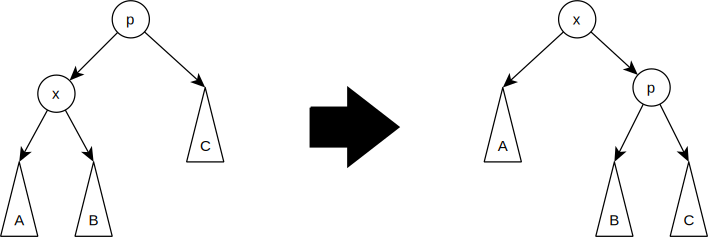

!!! Где
    [Википедия](https://ru.wikipedia.org/wiki/Splay-%D0%B4%D0%B5%D1%80%D0%B5%D0%B2%D0%BE)

## Сравнительнаят таблица

| Дерево   | Достоинства   |  Недостатки |  Сложность  |
|----------|---------------|-------------|-------------|
| Идеально сбаланс дерево  | Наилучшая возможная длина пути | Приходится перестраивать всё дерево, при вставке/удалении. Нужно продать душу | $log_2\ n$ |
| Дерево поиска | Простота  |   Может выродится в линейный список | $O(log\ n)$ или в худ. $O(n)$|
| АВЛ | Сбалансированы | Требуется балансировка | $O(log\ n)$ |
| КЧ = СДБ | Сбалансированы | Требуется балансировка. Требуются лишние поля, которые указывают на цвет/горизонтальную-вертекальную ссылку. | $2log_2\ n$ |
| ДБ | Сбалансированы | Требуется балансировка. Ассиметричны, хуже, чем СДБ. | $2log_2\ n$ |
| Б | Большие объемы данных | 50% памяти может не использоваться | $O(log_N\ n)$ |
| Оптимального поиска | Наилучшие, если известны вероятности поиска вершин | Сложность построения | $O(n^2)$ |
| **SPLAY** | Самобалансирующиеся | Может вырождаться, не работает для малого числа запросов | $O(log\ n)$ |

## Суть

Вершина, к которой обращались последней ставим наверх (операция splay). Если вероятность неравномерная - самые вероятные будут наверху, если вероятность равномерная, то дерево будет сбалансировано.

## Операции

### Splay

Основная операция дерева. Заключается в перемещении вершины в корень при помощи последовательного выполнения трёх операций: zig, zig-zig, zig-zag. Обозначим вершину, которую хотим переместить в корень за $x$, её родителя -- $p$, родителя $p$ (если существует) -- $g$. 

1. **Zig**: выполняется, когда p является корнем. Дерево поворачивается по ребру между x и p. Существует лишь для разбора крайнего случая и выполняется только один раз в конце, когда изначальная глубина x была нечётна. 
2. **Zig-zig**: выполняется, когда и x, и p являются левыми (или правыми) сыновьями. Дерево поворачивается по ребру между g и p, а потом — по ребру между p и x. 
3. **Zig-zag**:  выполняется, когда x является правым сыном, а p — левым (или наоборот). Дерево поворачивается по ребру между p и x, а затем — по ребру между x и g. 