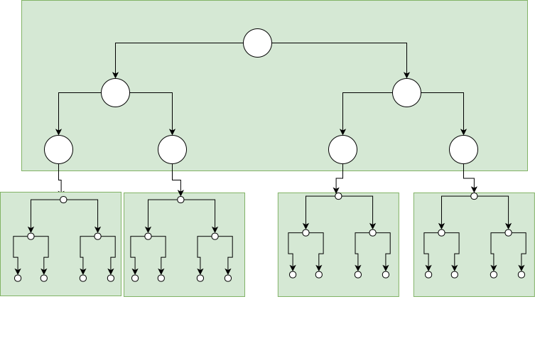

!!! Где
    Вирт, структуры данных 1989.

    Смотри 300 страницу.

    [На хабре](https://habr.com/en/post/114154/)

## Общие идеи

**Б-Дерево** - это сильноветвящееся дерево (дерево, которое может иметь более двух потомков). Область применения такого дерева - создание крупномасштабного дерева поиска, для хранения которого не хватает оперативной памяти. В этом случае вершины дерева должны хранится во вторичной памяти (например, на диске). Ссылки (указатели) представляют собой адреса не оперативной памяти, а адреса на диске. Поскольку каждый шаг теперь включает обращение к диску (что является долгой операцией), то крайне желательна организация памяти, при которой требуется меньше всего шагов по памяти. Если происходит обращение к одному элементу, рассположеному во вторичной памяти, то без больших затрат можно обратиться и к целой группе элементов: дерево разбито на поддеревья, которые одновременно доступны, назовём их страницами.

Пример разделения двоичного дерева поиска на страницы:

Если представить, что каждая страница хранит в себе 100 вершин (что разумно), то поиск в дереве с миллионом элементов будет в среднем требовать $log_{100}10^6 = 3$ обращений. Но если дерево растет случайным образом, то это число может возврасти до  $10^4$ обращений.

От идеальной сбалансированности можно практически сразу отказаться - требует слишком больших затрат на балансировку.

## Балансировка

Каждая страница должна содержать при заданном постоянном $n$ от $n$ до $2n$ вершин. Тогда для дерева с $N$ элементами и максимальным размером страницы в $2n$ вершин в самом худшем случае потребуется $log_n N$ обращений к страницам. Коэффициент использования памяти равен 50% - страницы заполнены всегда минимум на половину. Число $n$ назовём порядком Б-Дерева.

!!! info
    Часто вместо $n$ вводят $t$ - минимальную степень, тогда $t = n-1 \iff n = t+1$ (например в статье на хабре).

1. Каждая страница содержит не более $2n$ элементов (ключей).
2. Каждая страница, кроме корневой содержит не менее $n$ элементов.
3. Каждая страница либо представляет собой лист, либо имеет $m+1$ потомков, где $m$ - число ключей на этой странице.
4. Все страницы-листья находятся на одном уровне.

Организация поиска ясна. Если число ключей велико, то можно использовать бинарный поиск.

### Вставка

Если элемент нужно поместить на страницу с $m < 2n$, то процесс включения не требует изменения структуры, если включение происходит в уже полную страницу, то включение происходит так:

1. Страница, в которую происходит включение $C$, разделяется на две (создается $D$).
2. Ключи (их $2n+1$) поровну распределяются по $C$ и $D$, средний ключ перемещается вверх - на родительскую страницу.

!!! info
    Б-Деревья растут вверх.
    
    Смотри пример: Вирт 308 страница.

### Удаление

1. Удаление происходит из листа.
    1. Если ключей $m > n$ - то просто удаляем, ведь свойства Б-Дерева не нарушаются.
    2. Иначе:
        1. Существует слева или справа лист $L$ у которого ключей $m > n$ (то есть на один из этих листов ссылается указатель слева от ключа $k$ родителя, а на другой - указатель справа). Тогда удаляем, вместо удаляемого элемента ставим $k$, вместо $k$ ставим самый левый (если $L$ справа) или самый правый (если $L$ справа) ключ $L$. 
        2. Иначе объединим с каким-либо соседом, удалим ключ. Ключ родителя, который был разделителем этих листов переместим в этот новый узел (он будет там медианой).
2. Удаление происходит из внутреннего узла $X$.
    1. Если у узла по левой ссылке $m > n$, то самый правый элемент там обозначим за $k$. Удалим его из этого узла, удаляемый ключ заменим на $k$.
   
    2. Если у узла по правой ссылке $m > n$, то самый левый элемент там обозначим за $k$. Удаилм его из этого узла, удаляемый ключ заменим на $k$.
   
    3. Оба дочерних узла имеют $m = n$. Объединяем их в узел $Y$, переносим $k$ в $Y$, удаляем $k$ из $Y$ (рекурсивно). Делаем это для того, чтобы удалять $k$ на вершине ниже (чтобы затем добраться до листа). Если сливаются 2 последних потомка корня – то они становятся корнем, а предыдущий корень освобождается. 
   
